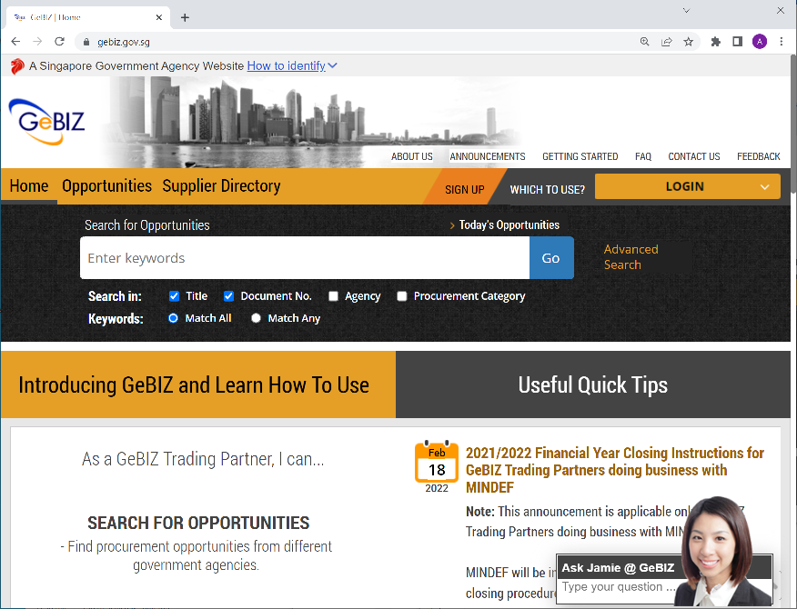
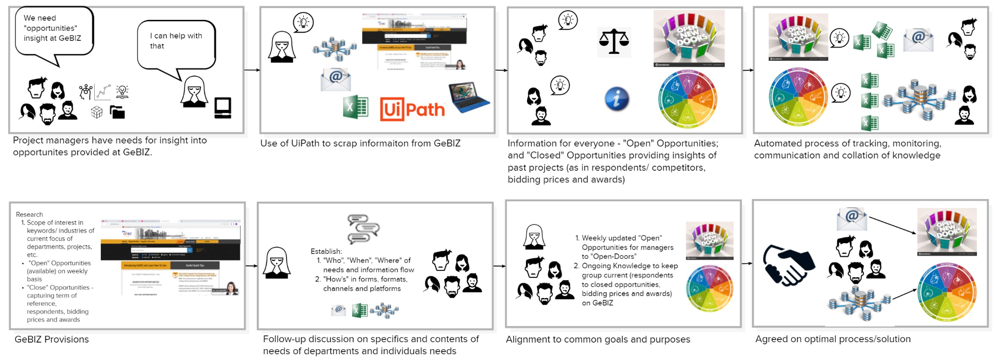

<!--
*** This is a direct adaption of Othneildrew and team's Best-README-Template
*** with superd Menu Selection and facilities
*** (https://github.com/othneildrew/Best-README-Template)
***
*** Thanks for checking out the Best-README-Template. If you have a suggestion
*** that would make this better, please fork the repo and create a pull request
*** or simply open an issue with the tag "enhancement".
*** Don't forget to give the project a star!
*** Thanks again! Now go create something AMAZING! :D
-->

<!-- PROJECT SHIELDS -->
<!--
*** I'm using markdown "reference style" links for readability.
*** Reference links are enclosed in brackets [ ] instead of parentheses ( ).
*** See the bottom of this document for the declaration of the reference variables
*** for contributors-url, forks-url, etc. This is an optional, concise syntax you may use.
*** https://www.markdownguide.org/basic-syntax/#reference-style-links
-->
[![Contributors][contributors-shield]][contributors-url]
[![Forks][forks-shield]][forks-url]
[![Stargazers][stars-shield]][stars-url]
[![Issues][issues-shield]][issues-url]
[![MIT License][license-shield]][license-url]
[![LinkedIn][linkedin-shield]][linkedin-url]

<!-- PROJECT LOGO -->
 

  

  <h3 align="center">PROJECT 1 – GeBIZ (RPA-C-01 | Tracking of Tenders)</h3>

  

    An awesome README template to jumpstart your projects!
     
    <a href="https://github.com/othneildrew/Best-README-Template"><strong>Explore the docs »</strong></a>
     
     
    <a href="https://github.com/othneildrew/Best-README-Template">View Demo</a>
    ·
    <a href="https://github.com/othneildrew/Best-README-Template/issues">Report Bug</a>
    ·
    <a href="https://github.com/othneildrew/Best-README-Template/issues">Request Feature</a>
  

<!-- TABLE OF CONTENTS -->

  
Table of Contents

  <ol>
    <li>
      <a href="#about-the-project">About The Project</a>
      <ul>
        <li><a href="#built-with">Built With</a></li>
      </ul>
    </li>
    <li>
      <a href="#getting-started">Getting Started</a>
      <ul>
        <li><a href="#prerequisites">Prerequisites</a></li>
        <li><a href="#installation">Installation</a></li>
      </ul>
    </li>
    <li><a href="#usage">Usage</a></li>
    <li><a href="#roadmap">Roadmap</a></li>
    <li><a href="#contributing">Contributing</a></li>
    <li><a href="#license">License</a></li>
    <li><a href="#contact">Contact</a></li>
    <li><a href="#acknowledgments">Acknowledgments</a></li>
  </ol>

<!-- ABOUT THE PROJECT -->
## About The Project
### Industry Challenge: Automating tracking of business tender opportunities
Projects are the lifeblood of many enterprises and they are often issued as tenders by large multinational corporations (MNCs) and/or government. Time and effort are usually spent monitoring or scanning through tender platforms such as GeBIZ. Furthermore, the specifications of the tenders are often hidden in attached documents prepared by client organisations, and going through this process can be tedious and time-consuming.

Here's why:
You need to monitor and keep track of opportunities (both open and closed) on “gebiz.gov.sg” because you want to stay on-top of:
1. Available opportunities (as in tenders, quotations and qualifications) projects
    - Focused on opportunities and targetting projects when made available; and
2. Have an insight, “ear-on-the-ground” so to said, on respondents/ competitors, bidding-prices and awards on project.”

(<a href="#top">back to top</a>)

### Built With

Major frameworks/libraries used on this project:
* [Windows Desktop](https://www.microsoft.com/en-sg/windows)
* [MS Office - Excel](https://www.office.com)
* [UiPath](https://www.uipath.com)

(<a href="#top">back to top</a>)

<!-- GETTING STARTED -->
## Getting Started
Your system must be installed and setup with above software in order to run your project locally.

### Prerequisites
_Instruction installing and setting up your app._
1. System running Windows 10 or 11
2. Microsoft Office - Excel
3. A community (free) version of UiPath-Studio works just fine [https://account.uipath.com](https://account.uipath.com/)

(<a href="#top">back to top</a>)

<!-- USAGE EXAMPLES -->
## Usage

Use this space to show useful examples of how a project can be used. Additional screenshots, code examples and demos work well in this space. You may also link to more resources.

_For more examples, please refer to the [Documentation](https://example.com)_

(<a href="#top">back to top</a>)

<!-- ROADMAP -->
## Roadmap

- [x] Credential Manager (Generic)
- [x] Data-Scrap on Open Opportunities
- [x] Data-Scrap on Closed Opportunities including info on Respondents, Bidding Prices and Awards
- [x] Write into Excel on details for both Open/ Closed Opportunities
- [x] Email to Specific User
- [ ] Email to Controlled-Scope and to Controlled-Users
- [ ] Use of Details/Info on Knowledgebase-Dashboard
- [ ] Seamless Integration of systems

(<a href="#top">back to top</a>)

<!-- CONTRIBUTING -->
## Contributing
Team Madagascar - **greatly appreciated** to all members of the team.

(<a href="#top">back to top</a>)

<!-- LICENSE -->
## License
[UiPath Academic Alliance](https://www.uipath.com/rpa/academic-alliance)

(<a href="#top">back to top</a>)

<!-- CONTACT -->
## Contact

RACE-SCT - [@raceacademy](https://raceacademy.com.sg/blog/) - enquiries@raceacademy.com.sg

Project Host: [RACE Academy](https://raceacademy.com.sg/)

(<a href="#top">back to top</a>)

<!-- ACKNOWLEDGMENTS -->
## Acknowledgments
List of resources and credits to:
* [Mural - Design Thinking](https://www.mural.co/)
* [UiPath-Studio](https://www.uipath.com/product/studio)
* [UiPath Academy](https://academy.uipath.com)
* [GitHub](https://github.com)

(<a href="#top">back to top</a>)

<!-- MARKDOWN LINKS & IMAGES -->
<!-- https://www.markdownguide.org/basic-syntax/#reference-style-links -->
[contributors-shield]: https://img.shields.io/github/contributors/othneildrew/Best-README-Template.svg?style=for-the-badge
[contributors-url]: https://github.com/othneildrew/Best-README-Template/graphs/contributors
[forks-shield]: https://img.shields.io/github/forks/othneildrew/Best-README-Template.svg?style=for-the-badge
[forks-url]: https://github.com/othneildrew/Best-README-Template/network/members
[stars-shield]: https://img.shields.io/github/stars/othneildrew/Best-README-Template.svg?style=for-the-badge
[stars-url]: https://github.com/othneildrew/Best-README-Template/stargazers
[issues-shield]: https://img.shields.io/github/issues/othneildrew/Best-README-Template.svg?style=for-the-badge
[issues-url]: https://github.com/othneildrew/Best-README-Template/issues
[license-shield]: https://img.shields.io/github/license/othneildrew/Best-README-Template.svg?style=for-the-badge
[license-url]: https://github.com/othneildrew/Best-README-Template/blob/master/LICENSE.txt
[linkedin-shield]: https://img.shields.io/badge/-LinkedIn-black.svg?style=for-the-badge&logo=linkedin&colorB=555
[linkedin-url]: https://linkedin.com/in/othneildrew
[product-screenshot]: images/screenshot.png
