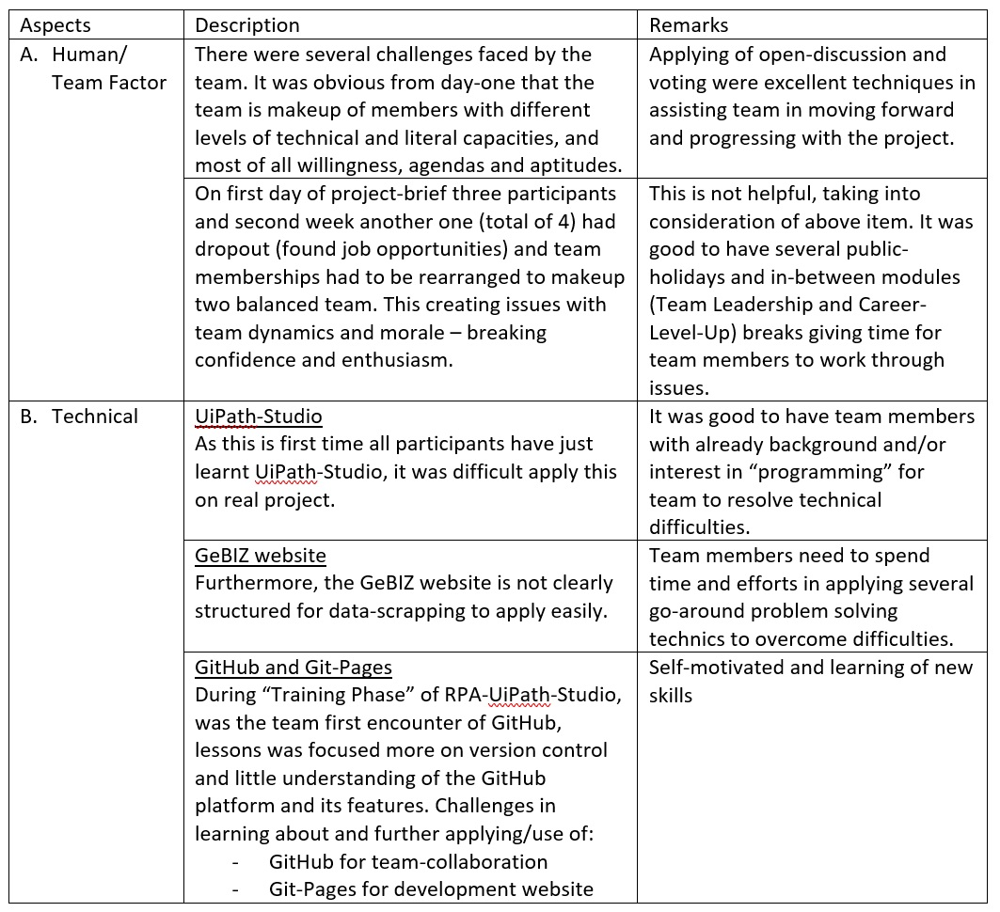
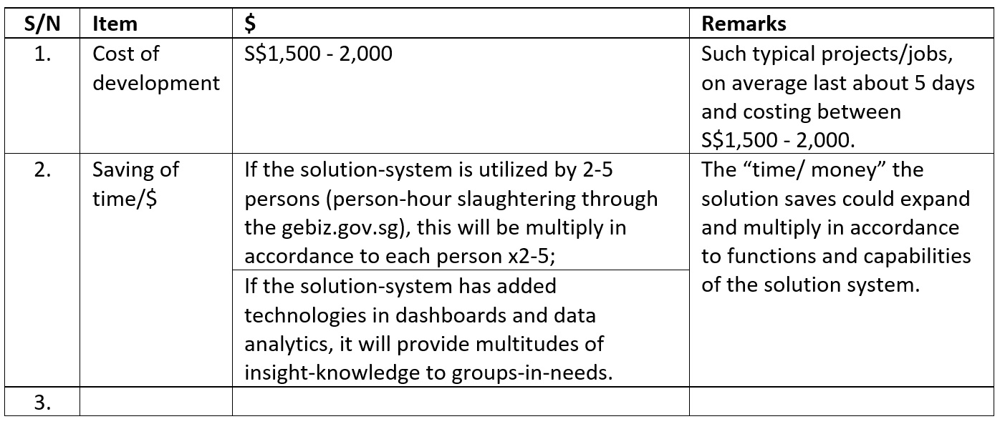

# Project1-GeBIZ (RPA-C-01 | Tracking of Tenders)
An awesome GeBIZ DATA-SCRAP Project [Switch to GitHub](https://github.com/alfredpyk/Project-GeBIZ).

## Industry Challenge: Automating tracking of business opportunities
Projects are the lifeblood of many enterprises and they are often issued as tenders by large multinational corporations (MNCs) and/or government. Time and effort ar e usually spent monitoring or scanning through tender platforms such as GeBIZ. Furthermore, the specifications of the tenders are often hidden in attached documents prepared by client organisations, and going through this process can be tedious and time-consuming.

## Background

GeBIZ is Singapore Government's one-stop e-procurement portal. Major public sector's such as Housing and Development Board, Judiciary-Sepreme Court, Land Transport Authority, etc. post their invitations for opportunities here. There are Procurement Categories such as Administration & Training, Consruction, Civi Engineering, etc.

Suppliers can search (using keyword/s and/or industry) for government procurement opportunities such as "Open" (Today, Past 2 days or Past 7 days) - Tenders, Quotations and Qualifications; Closed (Pending Award, Awarded, Cancelled or No Award) - Respondents, Bidding Prices and Awards; download opportunities requirement specifications, details on briefing and documents, and submit (both manual or digital submission types) their bids online.

 
# 1. Design Thinking
Approach project from 2 prongs and converging to one after week-1:
-	First is to get all members to focus on project’s “Pain and Smile” points and 
-	Second for all team members to be familiar on using UiPath-Studio on project.

## a) Pain and Smile Points
The team has identified some key “Pain and Smile” points:
-	The “gebiz.gov.sg” portal by itself is already very comprehensive for its purposes and direct individual usage;
-	As the portal is an individual logon, much information within are view only by individual, hence certain details could be scraped by the individual and disseminated/ communicated/ extended to others (probably controlled, as the company intent scopes of opportunities;
-	Certain details on closed opportunities could be collated as companies knowledgebase for use on competitors whether as benchmarks, on biddings and awards pricing, etc.
-	These information and/or analysis are confidential within group/s and within company;
-	For a project manager/ professional, searching for GeBIZ opportunities tends to be a rather manual process. Even worse, the process of consolidating and tracking the opportunities can be tedious and time-consuming. Precious time is wasted on performing such administrative work instead of preparing for a winning bid. In addition, much info could be gather for, planned and exercised as company's knowledgebase and communication purpose; and
-	On “Log in with SingPass”, care got to be taken on its use and considerations of both security measures and privacy. Probably, this should be avoided unless really necessary. There are such available measures as use of “credential” control at local (generic) and central (Orchestrator) locations.

## b) Needs Statement
With RPA, the bot could automatically login (an option) to GeBIZ every day (and/or weekly) and extract the opportunities based on the defined keywords. Details of the extracted opportunities will be updated into an Excel spreadsheet for easy viewing, tracking and email to particular manager/person. The bot can also download all the quotation documents into Knowledge Management system like SharePoint or LiveLink for further collaboration. Furthermore, it can further create a calendar invite in Outlook to keep track of the tender closing date.

## c) Ideate - StoryBoard
Raw ideas on the What’s and How’s Opportunities-Lead (on weekly basis) has a range of scopes (keywords-HDB, Green, Security, etc.) to search through:

## d) Prototype
The development will be built in parts/ modules integrating to form a system of functions/capabilities:
-	On simple user-window’s dialogue;
-	In-built data scraping tool;
-	Excel-spreadsheets of requested scope/ keyword; and
-	Stored/ sent to specifics users’ of interest in the scopes/ keywords.

# 2. Challenge Statement: As-Is
Given above context,
“Manager A, managing a busy and dynamic business, needs to monitor and keep track of opportunities (both open and closed) on “gebiz.gov.sg” because he wants to stay on-top of:
1.	Available opportunities/ projects and 
2.	Be able to keep his/her “ear-on-the-ground” on competitors, bidding-prices and awards.”

# 3. Process-Solution

# 4. Challenges

# 5. Time/Money/Lives Savings

# 6. Future Improvement
With time constraint, the team would make the following recommendations for future improvements:
1.	As it may not be necessary to login to GeBIZ, the login facilities may be left later when necessary, such as when required for downloading documents, submission of tender, etc.
2.	The application may recognise areas of interest with departments, managers and/or individuals; and direct email/ channel information to them, that is controlled receivers of email with defined scopes; and building of the knowledgebase;
3.	With ongoing scraping (probably weekly), a working dashboard/s displaying necessary/ segmented information view by both the company and/or control individuals on scopes of projects for monitoring and tracking purposes; and
4.	This project could be extended to data analytics and dashboarding of information scrapped.

# 7. Reference
## A. As per SCT 11 Project 1 Detailed Brief Apr 2022 Final (dated 27 Apr 2022), Slide-6

## B.	As per SCT 11 Project 1 Evaluation Matrix (dated 11 May 2022)

## C.	Madagascar's Project 1 - GeBIZ Report

<object data="ProjectGeBIZ.pdf" type="application/pdf" width="700px" height="700px">
    <embed src="ProjectGeBIZ.pdf">
        
This browser does not support PDFs. Please download the PDF to view it: <a href="ProjectGeBIZ.pdf">Download PDF</a>.

    </embed>
</object>

<a href="ProjectGeBIZ.pdf" download="ProjectGeBIZ.pdf">Download Madagascar's Project1 - GeBIZ Report</a>

<a href="ProjectProgressGeBIZ.pdf" download="ProjectGeBIZ.pdf">Download Madagascar's Weekly Project1 Progression Report</a>

