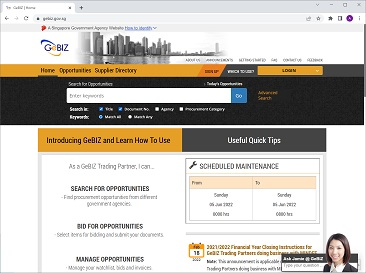
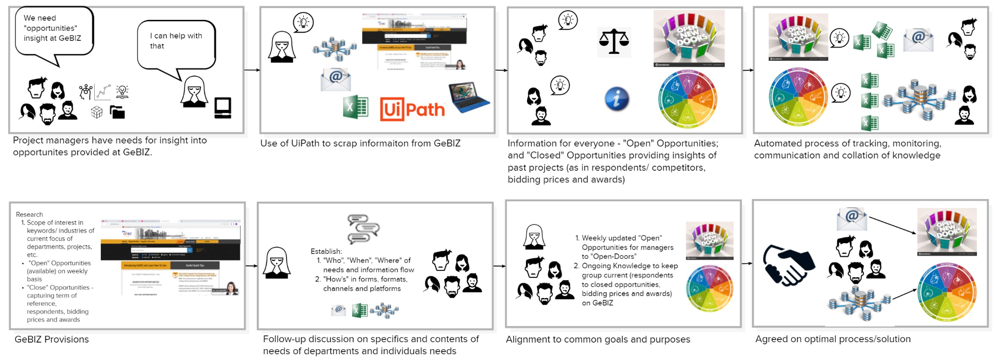
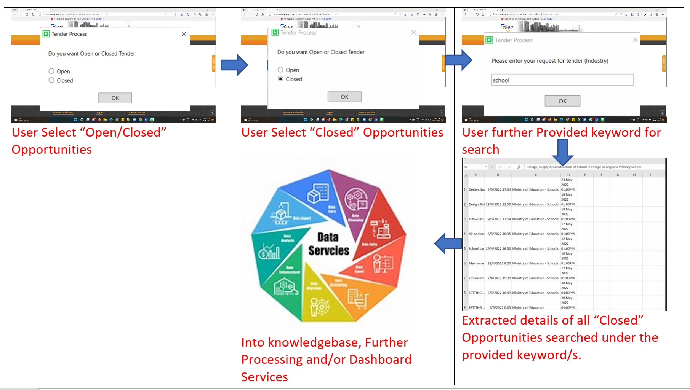
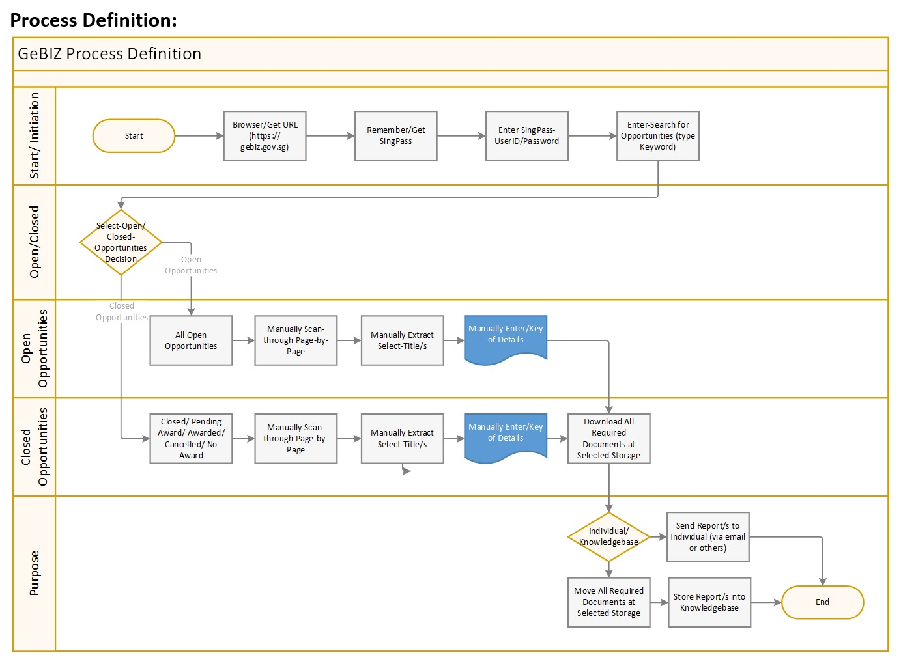
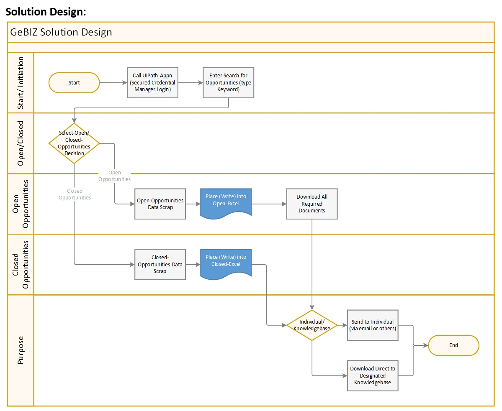
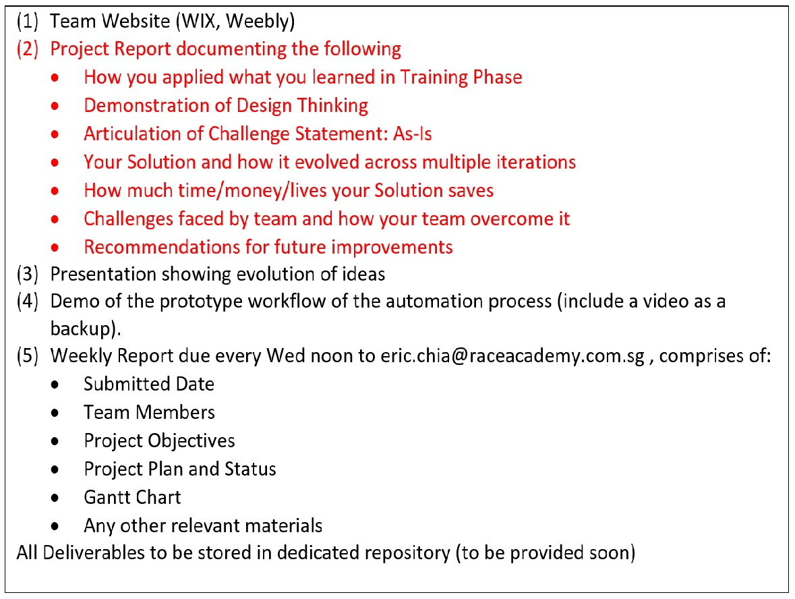
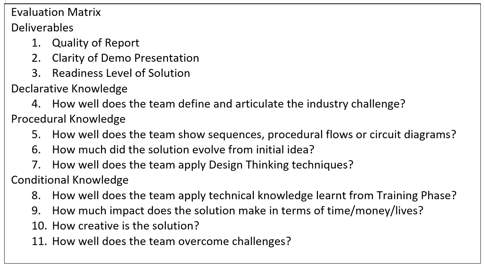

# Project1-GeBIZ (RPA-C-01 | Tracking of Tenders)
An awesome GeBIZ DATA-SCRAP Project [Switch to GitHub](https://github.com/alfredpyk/Project-GeBIZ).

## Industry Challenge: Automating tracking of business opportunities
Projects are the lifeblood of many enterprises and they are often issued as tenders by large multinational corporations (MNCs) and/or government. Time and effort ar e usually spent monitoring or scanning through tender platforms such as GeBIZ. Furthermore, the specifications of the tenders are often hidden in attached documents prepared by client organisations, and going through this process can be tedious and time-consuming.

## Background

GeBIZ is Singapore Government's one-stop e-procurement portal. Major public sector's such as Housing and Development Board, Judiciary-Sepreme Court, Land Transport Authority, etc. post their invitations for opportunities here. There are Procurement Categories such as Administration & Training, Consruction, Civi Engineering, etc.

Suppliers can search (using keyword/s and/or industry) for government procurement opportunities such as "Open" (Today, Past 2 days or Past 7 days) - Tenders, Quotations and Qualifications; Closed (Pending Award, Awarded, Cancelled or No Award) - Respondents, Bidding Prices and Awards; download opportunities requirement specifications, details on briefing and documents, and submit (both manual or digital submission types) their bids online.
 
# 1. Design Thinking
Approach project from 2 prongs and converging to one after week-1:
-	First is to get all members to focus on project’s “Pain and Smile” points and 
-	Second for all team members to be familiar on using UiPath-Studio on project.

## a) Pain and Smile Points
The team has identified some key “Pain and Smile” points:
-	The “gebiz.gov.sg” portal by itself is already very comprehensive for its purposes and direct individual usage;
-	As the portal is an individual logon, much information within are view only by individual, hence certain details could be scraped by the individual and disseminated/ communicated/ extended to others (probably controlled, as the company intent scopes of opportunities;
-	Certain details on closed opportunities could be collated as companies knowledgebase for use on competitors whether as benchmarks, on biddings and awards pricing, etc.
-	These information and/or analysis are confidential within group/s and within company;
-	For a project manager/ professional, searching for GeBIZ opportunities tends to be a rather manual process. Even worse, the process of consolidating and tracking the opportunities can be tedious and time-consuming. Precious time is wasted on performing such administrative work instead of preparing for a winning bid. In addition, much info could be gather for, planned and exercised as company's knowledgebase and communication purpose; and
-	On “Log in with SingPass”, care got to be taken on its use and considerations of both security measures and privacy. Probably, this should be avoided unless really necessary. There are such available measures as use of “credential” control at local (generic) and central (Orchestrator) locations.

## b) Needs Statement
With RPA, the bot could automatically login (an option) to GeBIZ every day (and/or weekly) and extract the opportunities based on the defined keywords. Details of the extracted opportunities will be updated into an Excel spreadsheet for easy viewing, tracking and email to particular manager/person. The bot can also download all the quotation documents into Knowledge Management system like SharePoint or LiveLink for further collaboration. Furthermore, it can further create a calendar invite in Outlook to keep track of the tender closing date.

## c) Ideate - StoryBoard
Raw ideas on the What’s and How’s Opportunities-Lead (on weekly basis) has a range of scopes (keywords-HDB, Green, Security, etc.) to search through:

## d) Prototype
The development will be built in parts/ modules integrating to form a system of functions/capabilities:
-	On simple user-window’s dialogue;
-	In-built data scraping tool;
-	Excel-spreadsheets of requested scope/ keyword; and
-	Stored/ sent to specifics users’ of interest in the scopes/ keywords.

## e) Test - On Exception
The team had several issues in Scrap and/or GetText of the GeBIZ website, such as:
|**Item** |**Test on Exception**         |**Remarks**            |
|:-------|:------------------------------|:----------------------|
| a)     |As data were not at all consistent/ structured accordingly;|Go around method/s in handling/ scrap.|
| b)     |Accurate count of item/s as compared to actual, as next-page was not handled correctly (scraping only first page, missing out on remaining);|Cross-checking and corrected when necessary, for example on “hdb” returning 44 Open Opportunities items (10 items per page)|
| c)     |There were needs to handle situations:||
|        |i.   When “Open” Opportunities with 0 (zero) listing;|Requires checking and handle according with dialogue of “no item found”.|
|        |ii.	 When use of keyword such as “rpa” returns gibberish; and|Could return such item as “carpark”, in which consisting "rpa", hence added “ " to all search item.|
|        |iii.	Keyword returning items with “Corrigendum”, publish of “corrected info” – hence upsetting consistency of display table/s (throw UiPath of its normal scrap)|This is part of GeBIZ in handling publish- “corrected info”, but may be resolve in using different scraping techniques.|
| d)     |Having to handle “Logout” of GeBIZ when task/s completed|Proper logout when session is completed.|

## f) What Platform
Team Madagascar will only focus on:
-	A Window-base desktop; 
-	With UiPath-Studio scraping on “gebiz.gov.sg” site;
-	This could be with either with/without SingPass login.;
-	If time permits, may be built upon UiPath-Orchestrator for “Unattended/Attended/Hybrid” implementation/s.
-	Email system for sending specific reports/ info to targeted project-managers

## g) GitHub and GitHub-Pages
During studies period (module on RPA-UiPath), the GitHub platform was introduced as a version control system and it allows for seamless collaboration with necessary controls over security, integrity and tracking of development of projects. It allows one to work together on projects from anywhere.
Team Madagascar saw the usefulness and decided to use it for the development and documentation of our Project-GeBIZ, so as to learn more of its extend and benefits. Here are some main benefits of using GitHub:
1.	<b>It makes it easy for participants to contribute to the project</b>, nevertheless, owing to its comprehensiveness and complexity, the team struggled through a steep-learning-curve;
2.	<b>Documentation</b>. By using GitHub, team Madagascar documented:
   -	Team members are able to learn about <b>tracking and observing the direction of development</b>;
   -	The UiPath solution is explained on its <b>in-built README.md</b>
   -	<b>Blog</b>. “GitHub-Pages” provides the facilities, from the GitHub repository (per project) for editing and pushing changes live on Project-Blog site. 
3.	<b>Showcase of work</b>. Team Madagascar is able to showcase the project during presentation.
4.	<b>Markdown</b>. Team Madagascar is able to further our learning on the Markdown language/ system and for future development purposes;
5.	<b>GitHub is a Repository</b>. It is a repository and a good one too, but not sure about the exposure and being out there in front of the public. Nevertheless excellent exposure team Madagascar and members on one of the largest software coding communities;
6.	<b>Track changes in code</b> (in our case the .xaml and project entities) <b>across versions</b>. When multiple people collaborate on a project, it’s hard to keep track revisions—who changed what, when, and where those files are stored. GitHub takes care of this problem by keeping track of all the changes that have been pushed to the repository, with a version history of the code so that previous versions are not lost with every iteration.
(posed some difficulties for Team Madagascar member as beginners) 
7.	<b>Integration Options</b>. It works well with UiPath-Studio, team Madagascar is able to publish UiPath-Studio <b>solution on Open-platform</b>, and yet able to <b>access directly on individual members desktop development</b> UiPath-Studio.

# 2. Challenge Statement: As-Is
Given above context,
“Manager A, managing a busy and dynamic business, needs to monitor and keep track of opportunities (both open and closed) on “gebiz.gov.sg” because he wants to stay on-top of:
1.	Available opportunities/ projects and 
2.	Be able to keep his/her “ear-on-the-ground” on competitors, bidding-prices and awards.”

# 3. Process-Solution

## Final Solution 
|**S/N** |**Function/ Sub-Function**     |**Remarks**            |
|:-------|:------------------------------|:----------------------|
| 1.     |Start/ Initiation              |                       |
|        |a) Call GeBIZ on Browser       |https://gebiz.gov.sg   |
|        |b) Credential Manager          |SingPass (secured)     |
|        |c) Enter Keyword               |Input Dialog           |
|        |d) Open/ Closed Opportunities  |Multiple Choice        |
| 2.     |Open Opportunities             |                       |
|        |a)	Extract Open Opportunities Item List|Data Scrap and write to Excel-file|
|        |b)	Extract Open Opportunities Item Details - Reference from Item-List|Data Scrap and write to Excel-file|
| 3.     |Download All "Tender Documents"|Save to Download/ specific location|
| 4.     |Closed Opportunities||
|        |a) Closed Opportunities Item List|Data Scrap and write to Excel-file|
|        |b)	Extract Item Details - Reference from Item-List|Data Scrap and write to Excel-file|
| 5.     |Email Excel-file to Specific Individual||
|        |a) Enter Specific Email Address|Input Dialog|
|        |b)	Extract Item Details - Reference from Item-List|SMTP Send|

# 4. Challenges

|**Aspects**  |**Description**                |**Remarks**            |
|:------------|:------------------------------|:----------------------|
|A. Human/Team|There were several challenges faced by the team. It was obvious from day-one that the team is makeup of members with different levels of technical and literal capacities, and most of all willingness, agendas and aptitudes.|Applying of open-discussion and voting were excellent techniques in assisting team in moving forward and progressing with the project.|
|             |On first day of project-brief four participants and second week another one (remaining 3) had dropout (found job opportunities) and team memberships had to be rearranged to makeup two balanced team. This creating issues with team dynamics and morale – breaking confidence and enthusiasm.|This is not helpful, taking into consideration of above item. It was good to have several public-holidays and in-between modules (Team Leadership and Career-Level-Up) breaks giving time for team members to work through issues.|
|             |In week-3 another dropout, 2 members remaining. It was appreciated that the dropping out members to complete all tasks before handing over.|This was another setback, as there were much to do for remaining members.|
|B. Schedule  |Owing the project was arranged/organized (allowing dropouts) and to how information (project scope, specifications and outcome expected) were disseminated to participants, making planning rather difficult and changes to workload (efforts, resources, etc.)|Refer to several changes in schedules/ gantt chart|
|C. Technical |UiPath-Studio: As this is first time all participants have just learnt UiPath-Studio, it was difficult apply this on real project.|It was good to have team members with already background and/or interest in “programming” for team to resolve technical difficulties.|
|             |GeBIZ website: Furthermore, the GeBIZ website is not clearly structured for data-scrapping to apply easily.|Team members need to spend time and efforts in applying several go-around problem solving technics to overcome difficulties 
|             |GitHub and Git-Pages: During “Training Phase” of RPA-UiPath-Studio, was the team first encounter of GitHub, lessons was focused more on version control and little understanding of the GitHub platform and its features. Challenges in learning about and further applying/use of: a)	GitHub for team-collaboration; and b)	Git-Pages for development website|Self-motivated and learning of new skills|

# 5. Time/Money/Lives Savings
|**S/N** |**Item**        |**$**                       |**Remarks                |
|-----|:------------------|:---------------------------|:------------------------|
| 1.  |Cost of Development|S$1,500 - 2,000|Such typical projects/jobs, on software development market average about 5 days and costing between S$1,500 - 2,000.|
| 2.  |Saving of time/$   |If the solution-system is utilized by 2-5 persons (person-hour slaughtering through the gebiz.gov.sg), this will be multiply in accordance to each person x2-5;|The “time/ money” the solution saves could expand and multiply in accordance to functions and capabilities of the solution system.|
|     |                   |If the solution-system has added functions, such as in dashboards and data analytics, it would further provide multitudes of insight-knowledge to groups-in-needs.|Added Saving of time/$|

# 6. Future Improvement
With time constraint, the team would make the following recommendations for future improvements:
1.	As it may not be necessary to login to GeBIZ, the login facilities may be left later when necessary, such as when required for downloading documents, submission of tender, etc.
2.	The application may recognise areas of interest with departments, managers and/or individuals; and direct email/ channel information to them, that is controlled receivers of email with defined scopes; and building of the knowledgebase;
3.	With ongoing scraping (probably weekly), a working dashboard/s displaying necessary/ segmented information view by both the company and/or control individuals on scopes of projects for monitoring and tracking purposes; and
4.	This project could be extended to data analytics and dashboarding of information scrapped.

# 7. Reference
## A. As per SCT 11 Project 1 Detailed Brief Apr 2022 Final (dated 27 Apr 2022), Slide-6

## B.	As per SCT 11 Project 1 Evaluation Matrix (dated 11 May 2022)

## C.	Madagascar's Project 1 - GeBIZ Reports

<object data="ProjectGeBIZ.pdf" type="application/pdf" width="700px" height="700px">
    <embed src="ProjectGeBIZ.pdf">
        
This browser does not support PDFs. Please download the PDF to view it: <a href="ProjectGeBIZ.pdf">Download PDF</a>.

    </embed>
</object>

<a href="ProjectGeBIZ.pdf" download="ProjectGeBIZ.pdf">Download Madagascar's Project1 - GeBIZ Report</a>

<a href="ProjectProgressGeBIZ.pdf" download="ProjectGeBIZ.pdf">Download Madagascar's Weekly Project1 Progression Report</a>

## D. Video Demo
1. MP4 - Streaming Recording of "Data Scrap on Open Opportunities" - with keyword "marine"
   a) Capturing its Reference-index of all Open Opportunities in a Excel-file
   b) Extract individually of title/s of all Open Opportunities
       - Detail information of each Reference-Index
       - Download ALL necessary documents for the tender
<Reference C:\Users\alfred\Videos\Flashback Express\Recordings\Flashback - 20220602  164511 (Marine_Open_Listing_Download.mp4>

2. 
